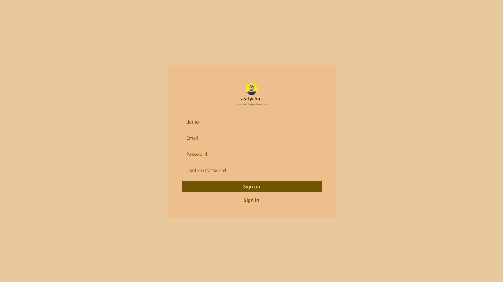
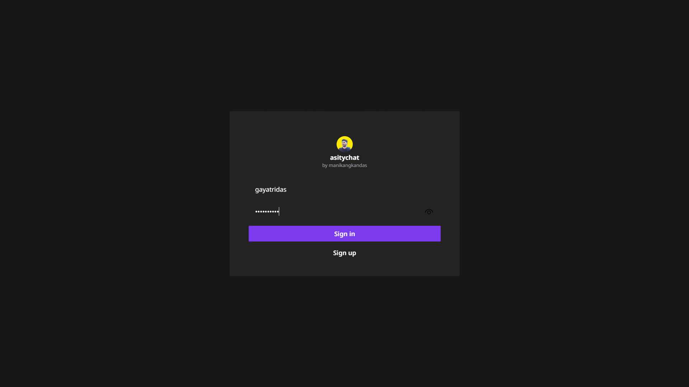
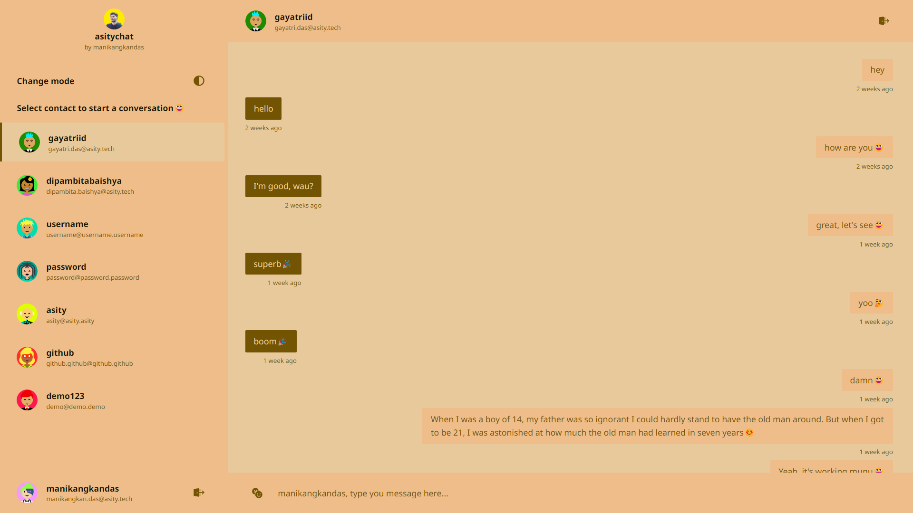
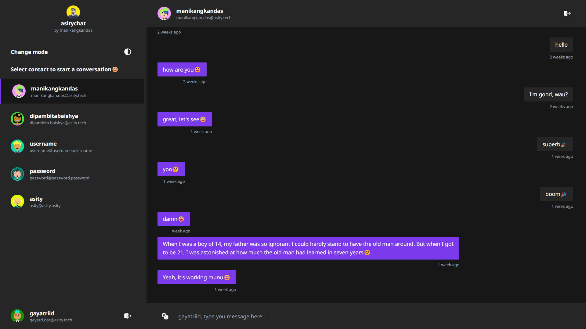
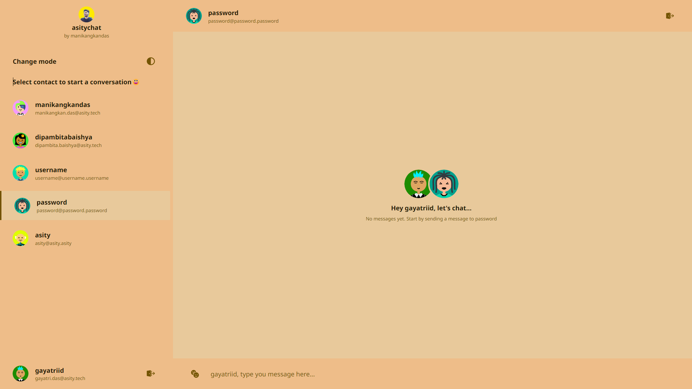
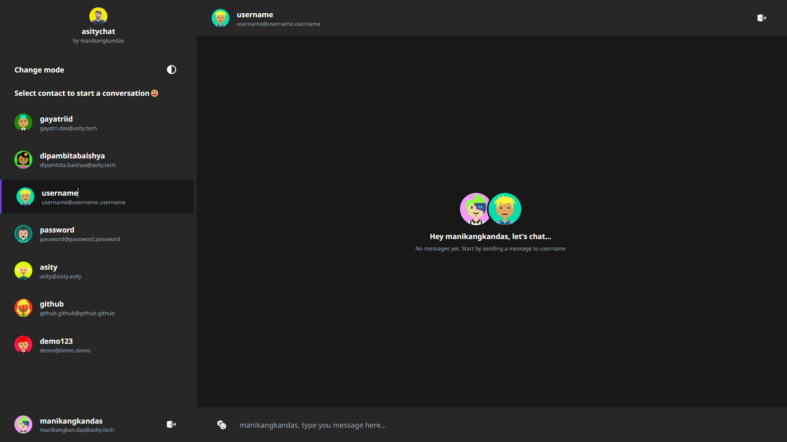
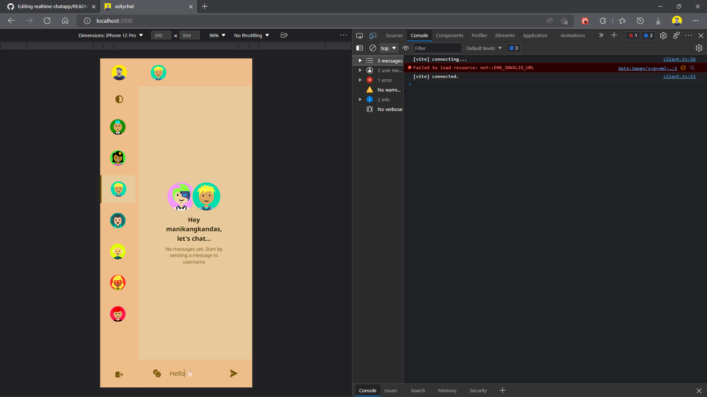
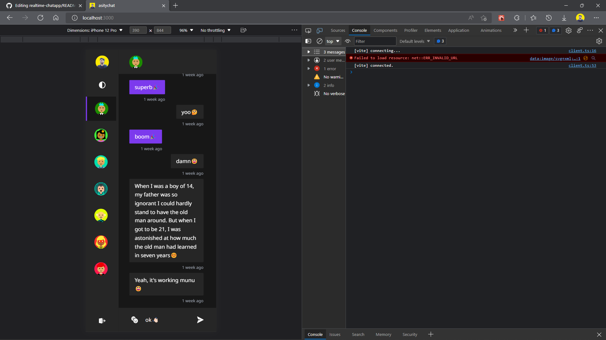

<div id="top"></div>

<!-- TABLE OF CONTENTS -->
<details>
  <summary>Table of Contents</summary>
  <ul>
    <li>
      <a href="https://manikangkandas.github.io/asitychat/">View Demo</a>
    </li>
    <li>
      <a href="https://github.com/manikangkandas/asitychat/issues">Report Bug</a>
    </li>
    <li>
      <a href="https://github.com/manikangkandas/asitychat/issues">Request Feature</a>
    </li>
    <li>
      <a href="#about-the-project">About The Project</a>
      <ul>
        <li><a href="#built-with">Screenshots</a></li>
        <li><a href="#built-with">Built With</a></li>
      </ul>
    </li>
    <li>
      <a href="#getting-started">Getting Started</a>
      <ul>
        <li><a href="#prerequisites">Prerequisites</a></li>
        <li><a href="#installation">Installation</a></li>
      </ul>
    </li>
    <li><a href="#contributing">Contributing</a></li>
    <li><a href="#license">License</a></li>
    <li><a href="#contact">Contact</a></li>
  </ul>
</details>

<!-- ABOUT THE PROJECT -->

## 📢 About The Project

asitychat is a real-time chat application built on top of the MERN Stack.

Features -

- Light & Dark theme
- Fully responsive
- Real time
- Secure authentication

<p align="right"><a href="#top">back to top</a></p>

## 💉 Screenshots










## 🏗️ Built With

- [Vite](https://vitejs.dev/)
- [React.js](https://reactjs.org/)
- [MongoDB](https://www.mongodb.com/)
- [Node.js](https://nodejs.dev/)
- [Socket.IO](https://socket.io/)
- [Tailwind CSS](https://tailwindcss.com/)

<p align="right"><a href="#top">back to top</a></p>

<!-- GETTING STARTED -->

## 🎊 Getting Started

After successful installation of the prerequisites, create credentials to proceed -

You will need to have at least two browser windows open with two different credentials to see the project in action.

Follow video demonstration🤝

### ⚙️ Prerequisites

Prerequisites are listed below, install in order to run the project successfully in you local machine.

- node
- git
- browser
- npm

  ```sh
  npm install npm@latest -g
  ```

  or

- yarn
  ```sh
  npm install --global yarn
  ```

### 🧑🏻‍🎤 Installation

1. Clone the repo

   ```sh
   git clone https://github.com/manikangkandas/asitychat.git
   ```

2. Navigate to dir api

   1. Install packages using NPM or YARN

      ```sh
      npm install
      ```

      or

      ```sh
      yarn add
      ```

   2. Run using NPM or YARN

      ```sh
      npm run dev
      ```

      or

      ```sh
      yarn dev
      ```

3. Open another terminal instance & navigate to dir client

   1. Install packages using NPM or YARN

      ```sh
      npm install
      ```

      or

      ```sh
      yarn add
      ```

   2. Run using NPM or YARN

      ```sh
      npm run dev
      ```

      or

      ```sh
      yarn dev
      ```

<p align="right"><a href="#top">back to top</a></p>

<!-- CONTRIBUTING -->

## 💁🏻‍♂️ Contributing

Contributions are what make the open source community such an amazing place to learn, inspire, and create. Any contributions you make are **greatly appreciated**.

If you have a suggestion that would make this better, please fork the repo and create a pull request. You can also simply open an issue with the tag "enhancement".
Don't forget to give the project a star! Thanks again!

1. Fork the Project
2. Create your Feature Branch `git checkout -b feature/AmazingFeature`
3. Commit your Changes `git commit -m 'Add some AmazingFeature'`
4. Push to the Branch `git push origin feature/AmazingFeature`
5. Open a Pull Request

<p align="right"><a href="#top">back to top</a></p>

<!-- LICENSE -->

## ©️ License

Distributed under the MIT License. See `LICENSE.txt` for more information.

<p align="right"><a href="#top">back to top</a></p>

<!-- CONTACT -->

## 🤝 Contact

Author Info - [@manikankandas](https://linkedin.com/in/manikangkandas) - manikangkan.das@outlook.com
<br />
Project Link - [https://github.com/manikangkandas/asitychat](https://github.com/manikangkandas/asitychat)

<p align="right"><a href="#top">back to top</a></p>
